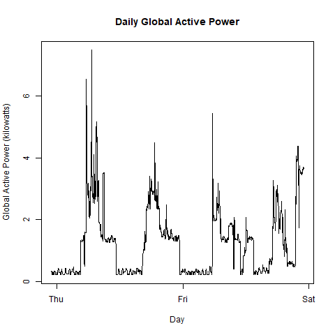
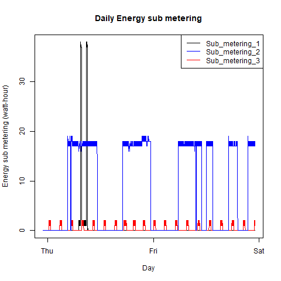
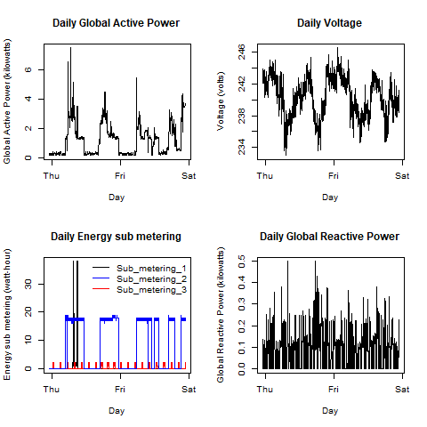

# README - Course 4 Exploratory Data Analysis - Module 1 - Course Project 1

This is my submission for Course Project 1, of the Exploratory Data Analysis coursera course (Roger D. Peng).

note: the original README is [here](./README.original.md).

## Data

- the data is downloaded and unzipped
- only relevant data is read into memory (for the given dates 2007-02-01 and 2007-02-02)
- data is tidied:
  - ? treated as na
  - dates and times are converted from strings. a combined datetime column is built.

## Plots

- each plot has a main title, and titles for each axis
- units are specified where available
- note: the x-axis label 'Day' is used instead of 'datetime' as this better matches the tick-labels.

## Source Code

Each plot has its own plotN.R file:

- [plot1.R](plot1.R)
- [plot2.R](plot2.R)
- [plot3.R](plot3.R)
- [plot4.R](plot4.R)

The source code minimises code duplication, by reusing code from shared 'utils.x.R' files.

- [utils.download_data.R](utils.download_data.R) - code that downloads and tidies the data
- [utils.install.R](utils.install.R) - code that installs packages if necessary
- [utils.plots.R](utils.plots.R) - code that redirects the plots to a PNG file of the correct size
- [utils.print.R](utils.print.R) - helper functions to show user what is happening, and make the output easier to read.

Assumption: the code is run from the command line via Rscript.
